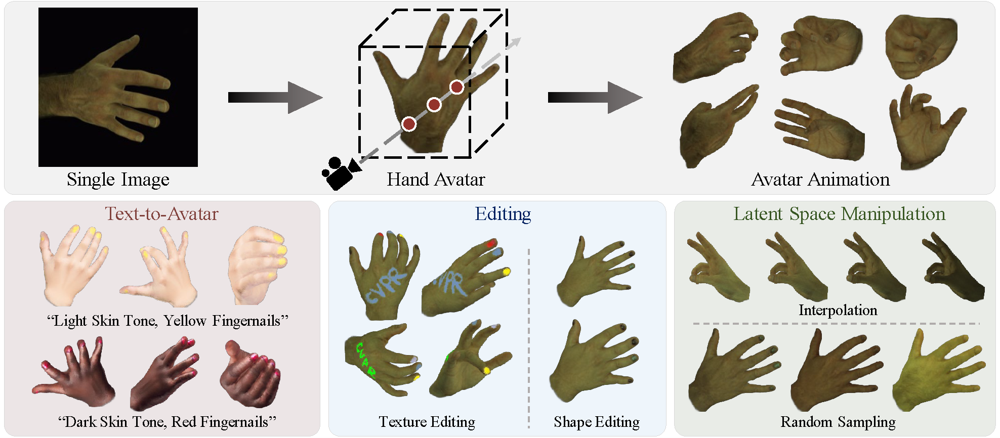

<div align="center">

<h1>OHTA: One-shot Hand Avatar via Data-driven Implicit Priors</h1>

<div>
    <a href='https://scholar.google.com/citations?user=3hSD41oAAAAJ' target='_blank'>Xiaozheng Zheng<sup>*</sup></a>&emsp;
    <a href='https://scholar.google.com/citations?user=v8TFZI4AAAAJ' target='_blank'>Chao Wen<sup>*</sup></a>&emsp;
    <a href='https://suzhuo.github.io/' target='_blank'>Zhuo Su<sup></sup></a>&emsp;
    <a href='https://scholar.google.com/citations?user=Yeawk5sAAAAJ' target='_blank'>Zeran Xu<sup></sup></a>&emsp;
    <a href='https://github.com/lizhaohu' target='_blank'>Zhaohu Li<sup></sup></a>&emsp;
    <a href='https://github.com/uzhaoyang' target='_blank'>Yang Zhao<sup></sup></a>&emsp;
    <a href='https://scholar.google.com/citations?&user=ECKq3aUAAAAJ' target='_blank'>Zhou Xue<sup>†</sup></a>&emsp;


</div>
<div>
    PICO, ByteDance
</div>
<div>
    <sup>*</sup>Equal contribution &emsp; <sup>†</sup>Corresponding author
</div>
<div>
    :star_struck: <strong>Accepted to CVPR 2024</strong>
</div>

---



<strong> OHTA is a novel approach capable of creating implicit animatable hand avatars using just a single image. It facilitates 1) text-to-avatar conversion, 2) hand texture and geometry editing, and 3) interpolation and sampling within the latent space.</strong>

---

<a href='https://zxz267.github.io/OHTA/'></a> <a href='http://arxiv.org/abs/2402.18969'></a> []()


</div>


## :mega: Updates

[02/2024] :partying_face: OHTA is accepted to CVPR 2024! Working on code release!


## :love_you_gesture: Citation
If you find our work useful for your research, please consider citing the paper:
```
@inproceedings{
  zheng2024ohta,
  title={OHTA: One-shot Hand Avatar via Data-driven Implicit Priors},
  author={Zheng, Xiaozheng and Wen, Chao and Zhuo, Su and Xu, Zeran and Li, Zhaohu and Zhao, Yang and Xue, Zhou},
  booktitle={Proceedings of the IEEE/CVF Conference on Computer Vision and Pattern Recognition},
  year={2024}
}
```

## :newspaper_roll: License

Distributed under the MIT License. See `LICENSE` for more information.
